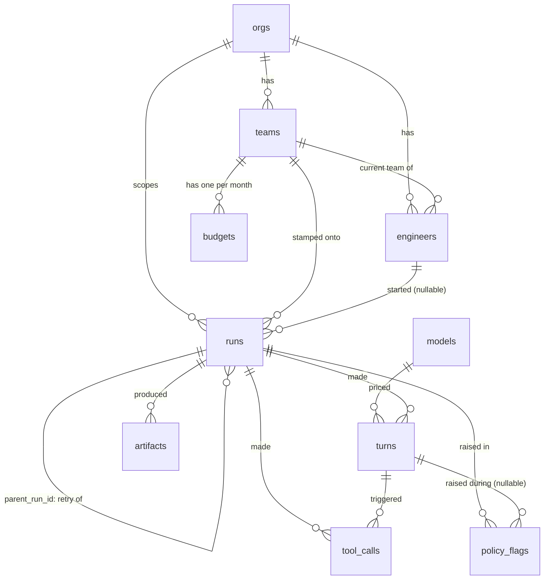

# Data model: tables, columns, keys, and how rows roll up

This is the map of every table the dashboard reads from and writes to. If you're about to write
a migration, a repository, or a query, read this first — it's the contract for what the shapes
mean, not just what they're called.

Storage is SQLite, but every choice is made as if a real Postgres sat behind it: numbered
migration files that only move forward, no SQL outside a repository class, and column types kept
boring enough to survive a driver swap. Section 5 spells out exactly what changes on that day.

## Conventions used everywhere below

- **Money is always whole cents, in an `INTEGER` column. Never a float.** A float rounds; money
  can't.
- **Every timestamp is UTC, stored as `TEXT` in ISO 8601 form** (`2026-08-29T14:03:00Z`). Storing
  it as plain text this way has a nice side effect: sorting or comparing the text sorts or
  compares the time correctly too, so a few of the checks below just compare timestamps as
  strings.
- **SQLite has no real enum type.** Anywhere the data can only be one of a fixed list of words
  (a status, a kind, a severity), the column is `TEXT` with a `CHECK` constraint spelling out the
  exact list. This is also exactly how you'd write it in Postgres before promoting it to a real
  `ENUM` type — see Section 5.
- **`id` columns are `INTEGER PRIMARY KEY AUTOINCREMENT`.** In SQLite this means an id is handed
  out once, keeps going up, and is never reused — so an old id sitting in a log or a link always
  points at the same row it always did, even after other rows are deleted.
- **SQLite does not enforce foreign keys unless you turn it on.** Every `REFERENCES` below is a
  real, documented link, but the connection code must run `PRAGMA foreign_keys = ON` once per
  connection or SQLite will happily accept a row that points at nothing. Postgres enforces these
  by default; this is one of the few places SQLite genuinely behaves differently from the
  database it's standing in for.

One naming trap worth flagging up front: `runs.trigger` is a real SQL keyword (`CREATE TRIGGER`).
It has to stay that name per the spec, but it means quoting it (`"trigger"`) in some contexts, and
whoever writes `RunRepository` should know that before they hit a confusing syntax error.

---

## 1. Table by table

### orgs
The company itself. Everything else hangs off one row here (this build only ever seeds one, but
nothing stops there being more).

| Column | Type | Empty? | Why it exists |
|---|---|---|---|
| id | INTEGER | no | Row identity. |
| name | TEXT | no | What shows in the header of the dashboard. |
| licensed_seats | INTEGER | no | The number every adoption rate divides by. This is a purchased count, not a count of engineer rows — see the callout after the `engineers` table. |
| created_at | TEXT | no | When the org came into being. |

```sql
CREATE TABLE orgs (
  id              INTEGER PRIMARY KEY AUTOINCREMENT,
  name            TEXT NOT NULL,
  licensed_seats  INTEGER NOT NULL CHECK (licensed_seats >= 0),
  created_at      TEXT NOT NULL
);
```

### teams
A group of engineers that shares a budget.

| Column | Type | Empty? | Why it exists |
|---|---|---|---|
| id | INTEGER | no | Row identity. |
| org_id | INTEGER | no | Which org this team belongs to. |
| name | TEXT | no | What shows on the team picker. |
| created_at | TEXT | no | When the team was set up. |

```sql
CREATE TABLE teams (
  id         INTEGER PRIMARY KEY AUTOINCREMENT,
  org_id     INTEGER NOT NULL REFERENCES orgs(id),
  name       TEXT NOT NULL,
  created_at TEXT NOT NULL
);
```

### engineers
A person with a seat.

| Column | Type | Empty? | Why it exists |
|---|---|---|---|
| id | INTEGER | no | Row identity. |
| org_id | INTEGER | no | Which org this person belongs to. |
| team_id | INTEGER | **yes** | Which team this person is on **right now**. Nullable so someone can exist between teams. |
| handle | TEXT | no | Short name, unique per org, used to look someone up. |
| display_name | TEXT | no | Full name shown on their own page. |
| seat_granted_at | TEXT | no | When they got access, for tenure-style questions. |
| seat_active | INTEGER (0/1) | no | Whether they currently hold one of the org's licensed seats. |

```sql
CREATE TABLE engineers (
  id               INTEGER PRIMARY KEY AUTOINCREMENT,
  org_id           INTEGER NOT NULL REFERENCES orgs(id),
  team_id          INTEGER REFERENCES teams(id),
  handle           TEXT NOT NULL,
  display_name     TEXT NOT NULL,
  seat_granted_at  TEXT NOT NULL,
  seat_active      INTEGER NOT NULL DEFAULT 1 CHECK (seat_active IN (0, 1)),
  UNIQUE (org_id, handle)
);
```

> **`orgs.licensed_seats` vs. `engineers.seat_active`.** These are two different numbers on
> purpose. `orgs.licensed_seats` is the number bought — the flat denominator the product brief
> says adoption rate must divide by, so someone who never touched the product still counts.
> `engineers.seat_active` says which specific person currently holds one of those seats, which is
> what the "dormant" bucket in depth-of-use needs (a seat, and zero runs). Nothing in the database
> forces these two to agree; keeping them in step is a job for the seed script and, later, the
> real provisioning system.

> **`engineers.team_id` is a snapshot of today, not history.** A run never looks up "what team is
> this engineer on" through this column — see `runs.team_id` below for why.

### models
A price. Not one row per model — one row per model **per price change**. A turn always points at
the exact row that was true when it ran, so a price change later never reaches back and rewrites
an old bill.

| Column | Type | Empty? | Why it exists |
|---|---|---|---|
| id | INTEGER | no | Row identity — this is what a turn points to. |
| provider | TEXT | no | Who makes the model. |
| name | TEXT | no | The model's name. |
| input_price_per_mtok_cents | INTEGER | no | Cents charged per million fresh input tokens. |
| cached_input_price_per_mtok_cents | INTEGER | no | Cents per million tokens read from cache — normally far cheaper than fresh input. |
| cache_write_price_per_mtok_cents | INTEGER | no | Cents per million tokens written into cache. |
| output_price_per_mtok_cents | INTEGER | no | Cents per million output tokens. Thinking tokens are billed at this same rate. |
| effective_from | TEXT | no | The moment this price took over from whatever came before it. |

```sql
CREATE TABLE models (
  id                                 INTEGER PRIMARY KEY AUTOINCREMENT,
  provider                           TEXT NOT NULL,
  name                               TEXT NOT NULL,
  input_price_per_mtok_cents         INTEGER NOT NULL CHECK (input_price_per_mtok_cents >= 0),
  cached_input_price_per_mtok_cents  INTEGER NOT NULL CHECK (cached_input_price_per_mtok_cents >= 0),
  cache_write_price_per_mtok_cents   INTEGER NOT NULL CHECK (cache_write_price_per_mtok_cents >= 0),
  output_price_per_mtok_cents        INTEGER NOT NULL CHECK (output_price_per_mtok_cents >= 0),
  effective_from                     TEXT NOT NULL,
  UNIQUE (provider, name, effective_from)
);
```

> **Where tool time is priced.** Tools that charge by the second — a sandbox, a browser, a code
> runner — are not priced from this table. Each tool call stores the cents it cost, on
> `tool_calls.cost_cents`, and a run's cost is its turn costs plus its tool call costs. We keep no
> hourly rate table for tools on purpose: the rate belongs to whoever bills for the tool, and a
> copy of it here is a second number that has to be kept in step with theirs. A free tool costs
> zero. See the updated formula in `docs/metrics.md`.

### runs
One task handed to an agent, start to finish. This is the busiest table in the reference sense —
almost every screen in the product brief starts here.

| Column | Type | Empty? | Why it exists |
|---|---|---|---|
| id | INTEGER | no | Row identity, and what a retry's `parent_run_id` points at. |
| org_id | INTEGER | no | Which org this run belongs to. |
| team_id | INTEGER | no | Which team this run counts against — **stamped at the moment the run starts**, never looked up through the engineer. See callout below. |
| engineer_id | INTEGER | **yes** | Who started it. Null when `trigger` is `automation`, since those runs have no person behind them. |
| parent_run_id | INTEGER | **yes** | Points at the **first** run of this task's chain of attempts. Null on that first run itself. This is the one column that lets a task retried three times get counted once instead of three times. |
| agent_kind | TEXT | no | Which kind of agent handled this run. **Deliberately an open string, not a fixed list** — the kinds an org runs are its own configuration and change without a schema change. `GET /api/filter-options` returns whichever kinds actually appear in the data. |
| trigger | TEXT | no | `person` or `automation` — whether a human kicked this off. Adoption only counts `person` runs. |
| repo | TEXT | **yes** | Which repo the work happened in. Null for tasks with no repo, like a report. |
| branch | TEXT | **yes** | Which branch, when there is a repo. |
| started_at | TEXT | no | When the run began. |
| actor_utc_offset_minutes | INTEGER | no | The time zone offset of the person (or automation) that started the run, in minutes. Kept so "today" can be redrawn against a local day later without losing the original context — see `docs/metrics.md`'s note that the org day is anchored to UTC on screen, but the raw offset is not thrown away. |
| finished_at | TEXT | **yes** | When the run ended. Null while it's still going — every run-level number in the product filters to `finished_at IS NOT NULL` first. |
| status | TEXT | no | One of `running`, `succeeded`, `failed`, `cancelled`, `timed_out`. |
| failure_cause | TEXT | **yes** | Which of the twelve causes in `docs/metrics.md` Group 4 ended it. Only set for `failed` and `timed_out`; null otherwise, including for `cancelled` (see callout). |
| blame | TEXT | **yes** | `org_setup`, `platform`, or `task` — whose problem the failure is. Only set alongside `failure_cause`. |
| is_quiet_failure | INTEGER (0/1) | no, defaults to 0 | A run that said it succeeded but didn't really do the job. Can only be true when `status = 'succeeded'` — that's the whole definition of "quiet". |
| duration_ms | INTEGER | **yes** | Wall clock time for the whole run, stored directly rather than computed from the two timestamps, because a run that hit a timeout has its duration **capped at the limit**, not its true elapsed time — see the Speed section of `docs/metrics.md`. Null while running. |
| total_cost_cents | INTEGER | no, defaults to 0 | The sum of every turn's cost for this run. Stored on the run so a dashboard read doesn't re-sum `turns` every time; kept in sync by the service layer as turns are written. The real, auditable number always lives in `turns.cost_cents`. |
| turn_count | INTEGER | no, defaults to 0 | Same idea — a cached count of this run's turns. |
| tool_call_count | INTEGER | no, defaults to 0 | Same idea — a cached count of this run's tool calls. |
| task_summary | TEXT | no, defaults to `''` | A short, one-line description of what the agent was asked to do — e.g. "Fix flaky checkout test" — so a run list can say more than "Run #4821". Added in migration `0002_add_task_summary.sql`. **Deliberately not the full task text** — see the callout right after this table. |

```sql
CREATE TABLE runs (
  id                       INTEGER PRIMARY KEY AUTOINCREMENT,
  org_id                   INTEGER NOT NULL REFERENCES orgs(id),
  team_id                  INTEGER NOT NULL REFERENCES teams(id),
  engineer_id              INTEGER REFERENCES engineers(id),
  parent_run_id            INTEGER REFERENCES runs(id),
  agent_kind               TEXT NOT NULL,
  "trigger"                TEXT NOT NULL CHECK ("trigger" IN ('person', 'automation')),
  repo                     TEXT,
  branch                   TEXT,
  started_at               TEXT NOT NULL,
  actor_utc_offset_minutes INTEGER NOT NULL,
  finished_at              TEXT,
  status                   TEXT NOT NULL CHECK (status IN
                              ('running', 'succeeded', 'failed', 'cancelled', 'timed_out')),
  failure_cause            TEXT CHECK (failure_cause IN (
                              'missing_permission', 'missing_secret_or_login', 'tool_not_available',
                              'network_or_sandbox_blocked', 'hit_token_or_time_limit',
                              'dependency_install_failed', 'ran_out_of_context',
                              'infrastructure_crash', 'rate_limited', 'model_refused',
                              'tests_failed', 'nothing_useful_produced'
                            )),
  blame                    TEXT CHECK (blame IN ('org_setup', 'platform', 'task')),
  is_quiet_failure         INTEGER NOT NULL DEFAULT 0 CHECK (is_quiet_failure IN (0, 1)),
  duration_ms              INTEGER,
  total_cost_cents         INTEGER NOT NULL DEFAULT 0 CHECK (total_cost_cents >= 0),
  turn_count               INTEGER NOT NULL DEFAULT 0 CHECK (turn_count >= 0),
  tool_call_count          INTEGER NOT NULL DEFAULT 0 CHECK (tool_call_count >= 0),
  task_summary             TEXT NOT NULL DEFAULT '',  -- added in migration 0002, see below
  CHECK (
    (status IN ('running', 'succeeded', 'cancelled') AND failure_cause IS NULL AND blame IS NULL)
    OR
    (status IN ('failed', 'timed_out') AND failure_cause IS NOT NULL AND blame IS NOT NULL)
  ),
  CHECK (is_quiet_failure = 0 OR status = 'succeeded'),
  CHECK (finished_at IS NULL OR finished_at >= started_at)
);
```

> **Why the full task text is never stored, only `task_summary`.** The prompt a person or an
> automation actually sent an agent can contain almost anything — a customer's name, a stack
> trace with an internal hostname in it, a pasted API key. This dashboard has no reason to hold
> any of that: nothing it shows needs the literal words a task was phrased in, only a short label
> a reader can recognize a run by. So `task_summary` is capped, by convention, to one short line
> — plenty for "Fix flaky checkout test," not enough to smuggle a paragraph of customer data back
> in. If a future screen genuinely needs the full task text, that is a new column with its own
> access and retention story, not a widening of this one.

> **Why `team_id` is stamped, not looked up.** People move teams. If a report worked out "which
> team did this run belong to" by joining through `engineers.team_id`, then the day an engineer
> moves from Team A to Team B, every run they ever made would silently become Team B's history —
> Team A's March would look emptier than it actually was, and nobody would know why last month's
> numbers changed. Writing `team_id` onto the run itself, once, at the moment it starts, freezes
> that fact. A report for "Team A, March" always shows what Team A actually did in March, forever.

> **Why `failure_cause` is null for `cancelled`.** A person changing their mind is not a fault of
> anything, so it has no cause and nobody to blame. Forcing a fourth value into a three-value blame
> enum would put "nobody's problem" next to "org setup" and "platform" as if they were the same
> kind of thing. A cancellation is fully described by `status = 'cancelled'` on its own, and the
> `CHECK` above enforces that. `failure_cause` and `blame` are reserved for the twelve real failure
> reasons that do have somebody to fix them. `docs/metrics.md` Group 4 says the same.

> **The chain, defined once.** A "chain" is a run and every retry that shares its `parent_run_id`
> — together, every attempt at one task. Given any run row, `COALESCE(parent_run_id, id)` is the
> id of the whole chain: it's the run's own id if it's the first attempt, or its parent's id if
> it's a retry. This one expression is what "collapse the chain to one task" means everywhere in
> this document.

**This convention has to be enforced, not just written down.** The foreign key only says
`parent_run_id` points at *some* run — it happily allows a third attempt to point at the second
attempt instead of the first. When that happens the chain silently splits in two: the later
attempts become their own phantom task, cost per task drops because a chain's total is now spread
across two rows, and a task that took four goes to look like two easy ones. Nothing errors, and
every number on the money and outcome screens is quietly wrong.

Verified against SQLite: with a three-attempt chain where the third attempt pointed at the second,
one task costing 1300 cents was reported as two tasks costing 600 and 700. So the database refuses
it outright:

```sql
CREATE TRIGGER runs_parent_must_be_first
BEFORE INSERT ON runs
WHEN NEW.parent_run_id IS NOT NULL
BEGIN
  SELECT RAISE(ABORT, 'parent_run_id must point at the first run of the chain')
  WHERE (SELECT parent_run_id FROM runs WHERE id = NEW.parent_run_id) IS NOT NULL;
END;
```

The rule lives in the database rather than in a repository class because every number in Group 2
and Group 3 of `docs/metrics.md` rests on it, and a rule that important should not depend on every
future caller remembering it. Postgres takes the same shape as a `BEFORE INSERT` trigger, or as a
`CHECK` against a small helper function.

### turns
One round of the model reading and replying, inside a run.

| Column | Type | Empty? | Why it exists |
|---|---|---|---|
| id | INTEGER | no | Row identity. |
| run_id | INTEGER | no | Which run this turn belongs to. |
| turn_index | INTEGER | no | Order of this turn inside its run, starting at 0. |
| model_id | INTEGER | no | Which exact price row was in effect — this is how a turn's cost never drifts when prices change later. |
| tokens_in_fresh | INTEGER | no, defaults to 0 | Fresh input tokens, priced at full rate. |
| tokens_in_cached | INTEGER | no, defaults to 0 | Input tokens served from cache, priced far cheaper — kept in its own column so "we used more" can be told apart from "the price changed". |
| tokens_cache_write | INTEGER | no, defaults to 0 | Tokens written into cache this turn. |
| tokens_out | INTEGER | no, defaults to 0 | Output tokens. |
| tokens_thinking | INTEGER | no, defaults to 0 | Reasoning tokens, billed at the output rate but tracked apart since a long reasoning pass can cost several times the visible answer. |
| latency_ms | INTEGER | no | How long this one model reply took — "turn time" in the Speed section. |
| finish_reason | TEXT | no | Why the model stopped: `stop`, `tool_call`, `length`, or `error`. |
| cost_cents | INTEGER | no | This turn's priced cost. The real source of truth for money; `runs.total_cost_cents` is a sum of these. |
| started_at | TEXT | no | When this turn began. |

```sql
CREATE TABLE turns (
  id                  INTEGER PRIMARY KEY AUTOINCREMENT,
  run_id              INTEGER NOT NULL REFERENCES runs(id),
  turn_index          INTEGER NOT NULL CHECK (turn_index >= 0),
  model_id            INTEGER NOT NULL REFERENCES models(id),
  tokens_in_fresh     INTEGER NOT NULL DEFAULT 0 CHECK (tokens_in_fresh >= 0),
  tokens_in_cached    INTEGER NOT NULL DEFAULT 0 CHECK (tokens_in_cached >= 0),
  tokens_cache_write  INTEGER NOT NULL DEFAULT 0 CHECK (tokens_cache_write >= 0),
  tokens_out          INTEGER NOT NULL DEFAULT 0 CHECK (tokens_out >= 0),
  tokens_thinking     INTEGER NOT NULL DEFAULT 0 CHECK (tokens_thinking >= 0),
  latency_ms          INTEGER NOT NULL CHECK (latency_ms >= 0),
  finish_reason       TEXT NOT NULL CHECK (finish_reason IN ('stop', 'tool_call', 'length', 'error')),
  cost_cents          INTEGER NOT NULL CHECK (cost_cents >= 0),
  started_at          TEXT NOT NULL,
  UNIQUE (run_id, turn_index)
);
```

### tool_calls
One tool invocation, inside a turn.

| Column | Type | Empty? | Why it exists |
|---|---|---|---|
| id | INTEGER | no | Row identity. |
| run_id | INTEGER | no | Which run, copied down from the turn so run-level rollups don't need to join through `turns` just to get here. |
| turn_id | INTEGER | no | Which turn made this call. |
| tool_name | TEXT | no | Which tool ran. |
| duration_ms | INTEGER | no | How long the call took. |
| outcome | TEXT | no | `success`, `error`, or `timeout`. |
| target | TEXT | **yes** | What the call acted on — a file path, a URL, a command. Null for tools with no single clear target. |
| error_type | TEXT | **yes** | The kind of error, when `outcome` is `error`. |
| cost_cents | INTEGER | no | What this call cost, in whole cents, as billed by whoever ran the tool. Zero for tools that are free. Added to the run's turn costs to get the run's total. |

```sql
CREATE TABLE tool_calls (
  id          INTEGER PRIMARY KEY AUTOINCREMENT,
  run_id      INTEGER NOT NULL REFERENCES runs(id),
  turn_id     INTEGER NOT NULL REFERENCES turns(id),
  tool_name   TEXT NOT NULL,
  duration_ms INTEGER NOT NULL CHECK (duration_ms >= 0),
  outcome     TEXT NOT NULL CHECK (outcome IN ('success', 'error', 'timeout')),
  target      TEXT,
  error_type  TEXT,
  cost_cents  INTEGER NOT NULL DEFAULT 0 CHECK (cost_cents >= 0),
  CHECK (outcome != 'error' OR error_type IS NOT NULL)
);
```

### artifacts
A thing a run produced.

| Column | Type | Empty? | Why it exists |
|---|---|---|---|
| id | INTEGER | no | Row identity. |
| run_id | INTEGER | no | Which run produced it. |
| kind | TEXT | no | `pull_request`, `commit`, `file`, or `report`. |
| ref | TEXT | no | The pointer to the actual thing — a pull request URL, a commit hash, a file path, a report id. |
| created_at | TEXT | no | When it was produced. |
| merged_at | TEXT | **yes** | When a human merged it. Null while an open pull request waits, and always null for `file` and `report`, which nothing merges. |
| reverted_at | TEXT | **yes** | When a human reverted or heavily rewrote it. Can only be set if `merged_at` is set — you can't revert what was never kept. |

```sql
CREATE TABLE artifacts (
  id          INTEGER PRIMARY KEY AUTOINCREMENT,
  run_id      INTEGER NOT NULL REFERENCES runs(id),
  kind        TEXT NOT NULL CHECK (kind IN ('pull_request', 'commit', 'file', 'report')),
  ref         TEXT NOT NULL,
  created_at  TEXT NOT NULL,
  merged_at   TEXT,
  reverted_at TEXT,
  CHECK (reverted_at IS NULL OR merged_at IS NOT NULL)
);
```

> `merged_at` and `reverted_at` are how "did a human keep it" gets answered without asking a
> human. A pull request that never merges helped nobody; one that merged and then got reverted
> within 14 days is what the rework rate counts.

### policy_flags
An agent tried something worth a second look.

| Column | Type | Empty? | Why it exists |
|---|---|---|---|
| id | INTEGER | no | Row identity. |
| run_id | INTEGER | no | Which run this happened in. |
| turn_id | INTEGER | **yes** | Which turn, when the flag ties to one specific model reply rather than the run as a whole. |
| kind | TEXT | no | Which of the nine kinds in `docs/metrics.md` Group 5. |
| severity | TEXT | no | `low`, `medium`, or `high`. |
| disposition | TEXT | no | `confirmed`, `expected_and_dismissed`, or `under_review`. |
| resource | TEXT | **yes** | The specific thing involved, when there is one — a domain, a file path, a command, a budget name. |
| created_at | TEXT | no | When the flag was raised. |

```sql
CREATE TABLE policy_flags (
  id           INTEGER PRIMARY KEY AUTOINCREMENT,
  run_id       INTEGER NOT NULL REFERENCES runs(id),
  turn_id      INTEGER REFERENCES turns(id),
  kind         TEXT NOT NULL CHECK (kind IN (
                 'suspected_prompt_injection', 'goal_hijacked', 'unsafe_tool_use',
                 'excess_access_requested', 'blocked_domain_attempt', 'secret_exposed',
                 'unsafe_command', 'attempted_exfiltration', 'spend_cap_crossed'
               )),
  severity     TEXT NOT NULL CHECK (severity IN ('low', 'medium', 'high')),
  disposition  TEXT NOT NULL CHECK (disposition IN
                 ('confirmed', 'expected_and_dismissed', 'under_review')),
  resource     TEXT,
  created_at   TEXT NOT NULL
);
```

### budgets
A team's monthly money limit. The only table a user can write to through the dashboard itself.

| Column | Type | Empty? | Why it exists |
|---|---|---|---|
| id | INTEGER | no | Row identity. |
| team_id | INTEGER | no | Which team this budget covers. |
| month | TEXT | no | The calendar month, as `YYYY-MM`, anchored to UTC. |
| limit_cents | INTEGER | no | The team's monthly money limit. |
| warn_cents | INTEGER | no | The line that only warns. Meant for daily use. |
| stop_cents | INTEGER | no | The line that would block new runs. |
| updated_at | TEXT | no | When someone last changed this row — worth tracking since it's the one editable table. |

```sql
CREATE TABLE budgets (
  id          INTEGER PRIMARY KEY AUTOINCREMENT,
  team_id     INTEGER NOT NULL REFERENCES teams(id),
  month       TEXT NOT NULL,
  limit_cents INTEGER NOT NULL CHECK (limit_cents >= 0),
  warn_cents  INTEGER NOT NULL CHECK (warn_cents >= 0),
  stop_cents  INTEGER NOT NULL CHECK (stop_cents >= 0),
  updated_at  TEXT NOT NULL,
  UNIQUE (team_id, month),
  CHECK (warn_cents <= stop_cents AND stop_cents <= limit_cents)
);
```

---

## 2. Keys and indexes, each tied to a metric

Every foreign key below needs its own index — a database does not index the "many" side of a
relationship automatically, and every one of these columns gets filtered or joined on constantly.

| Index | On | Which number in `docs/metrics.md` it's for |
|---|---|---|
| `idx_teams_org_id` | `teams(org_id)` | Any org-wide screen that needs every team under it. |
| `idx_engineers_org_id` | `engineers(org_id)` | Same, for people. |
| `idx_engineers_team_id` | `engineers(team_id)` | A team's current roster. |
| `idx_runs_org_id_started_at` | `runs(org_id, started_at)` | **Adoption rate**, **sticking rate** — both need "engineers with a run in a window", scoped to the org. |
| `idx_runs_engineer_id_started_at` | `runs(engineer_id, started_at)` | **Depth of use** — needs each engineer's run count over the last 30 days, and their most recent run for the dormant/light/regular/deep split. |
| `idx_runs_team_id_started_at` | `runs(team_id, started_at)` | Team-level, this-week screens: team success rate, team spend pace. |
| `idx_runs_parent_run_id` | `runs(parent_run_id)` | **Finished tasks**, **cost per finished task**, **retry rate**, **success rate (in the end)** — every one of these first collapses a chain of retries to one task, and this index is what makes finding a chain's members fast. |
| `idx_runs_status_finished_at` | `runs(status, finished_at)` | **Success rate (first try)**, **failure rate by cause** — both filter to runs that reached an end within a rolling window, then split by status. |
| `idx_runs_blame` | `runs(blame) WHERE blame IS NOT NULL` | **Failure rate by cause**, specifically the org-setup / platform / task split — a partial index, since most runs succeed and have no blame at all, so there's no reason to index them here. |
| `idx_runs_quiet_failure` | `runs(org_id) WHERE is_quiet_failure = 1` | **Quiet failures** — same reasoning: almost every row won't match, so only index the ones that do. |
| `idx_turns_run_id` | `turns(run_id)` | Rolling a run's turns up into its cost and token totals; also serves **cost per finished task**. |
| `idx_turns_model_id` | `turns(model_id)` | Reporting cost or tokens by model. |
| `idx_turns_started_at` | `turns(started_at)` | **Turn time p50/p95/p99** — the percentile queries need every turn in a window, ordered. |
| `idx_tool_calls_run_id` | `tool_calls(run_id)` | Rolling a run's tool calls into its `tool_call_count`. |
| `idx_tool_calls_turn_id` | `tool_calls(turn_id)` | Joining a tool call back to the turn that made it. |
| `idx_artifacts_run_id` | `artifacts(run_id)` | Finding what a run produced. |
| `idx_artifacts_kind_merged_at` | `artifacts(kind, merged_at)` | **What came out** (counts by kind) and **merged pull requests** specifically. |
| `idx_policy_flags_run_id` | `policy_flags(run_id)` | Finding a run's flags. |
| `idx_policy_flags_turn_id` | `policy_flags(turn_id)` | Finding a turn's flags. |
| `idx_policy_flags_kind_created_at` | `policy_flags(kind, created_at)` | **Flags shown as a trend** — ranking "new for this team" needs each kind's history over time. |
| `idx_policy_flags_disposition` | `policy_flags(disposition)` | How often a flag gets dismissed as expected. |
| (unique) | `budgets(team_id, month)` | **Budget and burn pace** — one row per team per month, and the fast lookup path for it. |
| (unique) | `models(provider, name, effective_from)` | Pricing a turn correctly and stopping duplicate price entries for the same day. |
| (unique) | `turns(run_id, turn_index)` | Keeps a run's turns in a strict, gapless order. |
| (unique) | `engineers(org_id, handle)` | Looking someone up by handle within their org. |

---

## 3. How the tables link



In plain words: an org has teams and engineers. Every run is stamped with the org, the team it
happened for, and (usually) the engineer who started it. A run can point back at another run as
its parent — that's the retry chain. Every run has turns, every turn belongs to one priced model,
and every turn can have tool calls. Runs produce artifacts and can raise flags; flags can drill
down to the exact turn they happened in, or stay at the run level. Each team gets one budget row
per month.

---

## 4. Three hard numbers, worked in real SQL

> **Read this as the definition, not as the code.** The SQL below is exact and it runs — it is
> how each number is defined, and it is what the service's answer must agree with. But the code
> splits the work: the repository does the chain collapsing, window filtering and grouping, and
> the service turns those rows into the median, the rate or the percentile. See
> `docs/decisions.md` entry 10 for why. If you change a definition here, a service test should
> fail — that is the point.


All three lean on one idea, defined once above: a **chain** is a run and every retry sharing its
`parent_run_id`, and `COALESCE(parent_run_id, id)` is the id of the whole chain — the "task" that
`docs/metrics.md` keeps talking about.

### Cost per finished task (median, average, worst case)

Every run in the chain counts toward the cost, including the ones that failed — that's the
fairness rule from `docs/metrics.md`: a cheap model that needs three retries can cost more than an
expensive one that gets it right first, and only counting the winning run would hide that.

```sql
WITH chain_costs AS (
  SELECT
    COALESCE(parent_run_id, id) AS task_id,
    total_cost_cents,
    status
  FROM runs
  WHERE org_id = :org_id
    AND finished_at IS NOT NULL
    AND finished_at >= :window_start
    AND finished_at <  :window_end
),
task_totals AS (
  SELECT
    task_id,
    SUM(total_cost_cents) AS task_cost_cents,
    MAX(CASE WHEN status = 'succeeded' THEN 1 ELSE 0 END) AS ever_succeeded
  FROM chain_costs
  GROUP BY task_id
),
finished_task_costs AS (
  SELECT task_cost_cents
  FROM task_totals
  WHERE ever_succeeded = 1
),
ranked AS (
  SELECT
    task_cost_cents,
    ROW_NUMBER() OVER (ORDER BY task_cost_cents) AS rn,
    COUNT(*)     OVER ()                          AS n
  FROM finished_task_costs
)
SELECT
  (SELECT AVG(task_cost_cents) FROM ranked WHERE rn IN ((n + 1) / 2, (n + 2) / 2)) AS median_cents,
  (SELECT AVG(task_cost_cents) FROM finished_task_costs)                          AS average_cents,
  (SELECT MAX(task_cost_cents) FROM finished_task_costs)                          AS worst_case_cents,
  (SELECT COUNT(*)             FROM finished_task_costs)                         AS finished_task_count;
```

The `rn IN ((n+1)/2, (n+2)/2)` trick is the plain way to get an exact median with whole-number
math: for an odd count both expressions land on the same middle row; for an even count they land
on the two middle rows and get averaged. No library function, no approximation.

### Success rate, first try vs. in the end

A run a person cancelled in its first few seconds is neither a win nor a loss, so it's pulled out
before either rate is worked out (the query below uses 5 seconds as that cutoff).

```sql
-- First try: does the agent get it right on the first attempt, on its own?
WITH ended AS (
  SELECT status
  FROM runs
  WHERE org_id = :org_id
    AND finished_at IS NOT NULL
    AND finished_at >= :window_start
    AND finished_at <  :window_end
    AND NOT (status = 'cancelled' AND duration_ms < 5000)
)
SELECT
  SUM(CASE WHEN status = 'succeeded' THEN 1 ELSE 0 END) * 1.0 / COUNT(*) AS first_try_success_rate,
  COUNT(*) AS runs_scored
FROM ended;
```

```sql
-- In the end: did the person get what they needed, retries included?
-- The window is anchored on when the TASK started, not when each retry finished --
-- otherwise a chain that spans midnight gets its later retries cut off from its first attempt.
WITH anchors AS (
  SELECT id AS task_id
  FROM runs
  WHERE org_id = :org_id
    AND parent_run_id IS NULL
    AND started_at >= :window_start
    AND started_at <  :window_end
),
chain_members AS (
  SELECT
    a.task_id,
    r.status
  FROM runs r
  JOIN anchors a ON COALESCE(r.parent_run_id, r.id) = a.task_id
  WHERE r.finished_at IS NOT NULL
    AND NOT (r.status = 'cancelled' AND r.duration_ms < 5000)
),
tasks AS (
  SELECT
    task_id,
    MAX(CASE WHEN status = 'succeeded' THEN 1 ELSE 0 END) AS ever_succeeded
  FROM chain_members
  GROUP BY task_id
)
SELECT
  SUM(ever_succeeded) * 1.0 / COUNT(*) AS eventual_success_rate,
  COUNT(*) AS tasks_scored
FROM tasks;
```

### p95 run time, in one pass over the raw rows

Timed-out runs are left out — their duration is capped at the timeout limit, not their real
elapsed time, and mixing them in would make things look faster exactly when more runs are giving
up sooner. This is the one number in this document that leans on a **window function**: instead
of collapsing rows into one, a window function keeps every row but lets it see the rows around it
— here, its position in the sorted list of durations — which is exactly what a percentile is.

```sql
WITH finished_runs AS (
  SELECT duration_ms
  FROM runs
  WHERE org_id = :org_id
    AND status IN ('succeeded', 'failed')   -- timed_out excluded on purpose, see docs/metrics.md
    AND finished_at >= :window_start
    AND finished_at <  :window_end
),
ranked AS (
  SELECT
    duration_ms,
    CUME_DIST() OVER (ORDER BY duration_ms) AS position
  FROM finished_runs
)
SELECT MIN(duration_ms) AS p95_run_time_ms
FROM ranked
WHERE position >= 0.95;
```

`CUME_DIST()` gives each row the share of rows at or below it once everything is sorted; the
smallest duration where that share crosses 95% is, by definition, p95. Same shape of query — swap
the column and the `WHERE` clause — gives turn-time p50/p95/p99 from `turns.latency_ms` instead.

---

## 5. What changes when this becomes real Postgres

| This SQLite build | Real Postgres |
|---|---|
| `INTEGER PRIMARY KEY AUTOINCREMENT` | `BIGINT GENERATED ALWAYS AS IDENTITY PRIMARY KEY` |
| `TEXT` timestamps, ISO 8601 UTC | `TIMESTAMPTZ` — a real timestamp type. Postgres always shows it back in UTC or the session's zone, which is exactly why `runs.actor_utc_offset_minutes` stays its own column even after the move: the original local offset isn't part of a `TIMESTAMPTZ` value and would otherwise be lost. |
| `TEXT` + `CHECK` standing in for an enum | A real `CREATE TYPE ... AS ENUM (...)`, one per constrained column: `runs.status`, `runs.failure_cause`, `runs.blame`, `runs.trigger`, `turns.finish_reason`, `tool_calls.outcome`, `artifacts.kind`, `policy_flags.kind`, `policy_flags.severity`, `policy_flags.disposition`. |
| `INTEGER` used as a boolean (0/1) | Real `BOOLEAN`, for `engineers.seat_active` and `runs.is_quiet_failure`. |
| Money as `INTEGER` cents | Stays `INTEGER` cents — no reason to change a working choice. Worth knowing: SQLite's `INTEGER` already silently grows to 8 bytes when a value needs it, and Postgres's `SUM()` over an `INTEGER` column automatically returns a `BIGINT`, so an org-wide cost total isn't at real risk of overflow in either engine even though a single `INTEGER` column caps out around $21.4 million. |
| Foreign keys are advisory unless `PRAGMA foreign_keys = ON` is set per connection | Enforced always, no setup needed. |
| One writer at a time (whole-file lock) | Real concurrent writers through MVCC — matters the day this stops reading from a one-time seed script and starts taking live traffic. |
| B-tree indexes only, in practice | Postgres adds two worth knowing about here: a **BRIN** index, which is a cheap, small index good for a column like `turns.started_at` once that table is huge and mostly queried by recent time range; and **`CREATE INDEX CONCURRENTLY`**, which builds an index without locking the table for writes — SQLite locks the whole file for the (short) time an index takes to build. |

Partial indexes (the `WHERE` clause on `idx_runs_blame` and `idx_runs_quiet_failure`) need no
change at all — SQLite has supported them since 2013, same syntax as Postgres.

---

## 6. What we deliberately did not build

**No daily rollup tables.** Every number in this document is worked out straight from `runs`,
`turns`, and `tool_calls` at read time, over raw rows, with no table that pre-adds up a day's
worth of anything. This is a real gap, taken on purpose, not an oversight.

Two things are easy to confuse here, so to be precise: the small cached numbers already sitting on
`runs` (`total_cost_cents`, `turn_count`, `tool_call_count`) are **not** rollups in this sense.
Those are one row summarizing its own children — cheap to keep in sync, and gone the moment that
run is deleted. A rollup table is different: a row that summarizes many runs across a day or a
team, built by a separate job, that has to be recomputed or reconciled whenever the truth
underneath it changes. That's the piece missing here.

Why leave it out: the seeded data set is small enough that a raw scan across every run in a
90-day window, even with the joins and window functions in Section 4, finishes fast enough for a
page load. Building a rollup table means also building and testing the job that keeps it correct,
and a wrong rollup is worse than no rollup — it looks authoritative and lies quietly.

**Where that stops being true:** once `turns` — the largest of these tables, since one run holds
several turns — passes somewhere around **five million rows**, a full window-function scan over a
realistic reporting window stops being instant and starts being noticeable on a page load, even
with every index in Section 2 in place. That's the point a daily rollup table earns its keep: one
row per team per day per metric, built once when the day closes, so a 90-day report reads 90 rows
instead of scanning everything underneath them.

That's a different, much later problem than the one `docs/metrics.md` already flags for
percentiles specifically: it warns that if `turns` ever reaches the **billions** of rows, even a
daily rollup can't compute an exact p95 anymore, and the fix there is a compressed sketch
(a "t-digest") stored per day instead of the raw values. Five million rows is "add a rollup
table"; billions of rows is "the exact math itself needs to change". This build is nowhere near
either — it's worth naming both thresholds now so whoever hits the first one doesn't reach for
the second one's fix by mistake.
